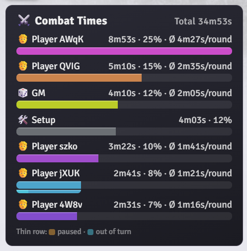
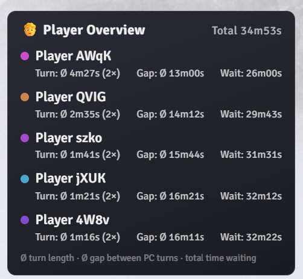
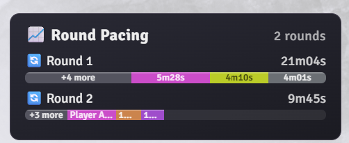
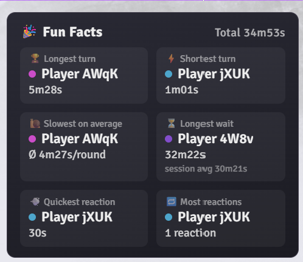
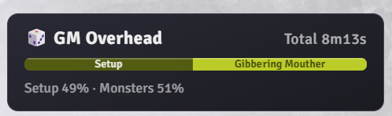
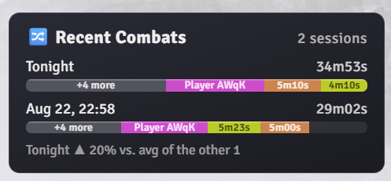
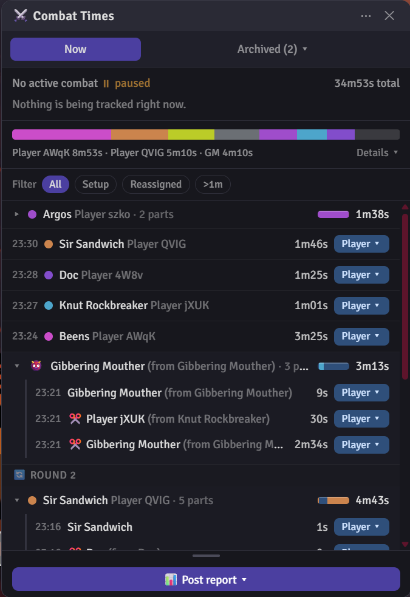

# Foundry VTT Combat Timer

A Tampermonkey userscript for [Foundry VTT](https://foundryvtt.com/) that tracks how much time each player — and the GM — spends during combat, entirely in your own browser: no module installation, no GM permission needed, nothing written to the server or synced between players.

> **AI disclaimer:** Although I am a professional C++ software developer and an [ISAQB](https://www.isaqb.org/)-certified software architect, this project is entirely vibe coded. The AI used is mostly [Claude Sonnet 5](https://claude.ai/) and occasionally [Claude Opus 5](https://claude.ai/) for heavier tasks. Review the source yourself before relying on it for anything you care about.

## Requirements

- The [Tampermonkey](https://www.tampermonkey.net/) browser extension (Chrome, Firefox, Edge, etc.).
- Foundry VTT v13 or v14. Built and tested against v14; most of it should keep working on v13.
- Tuned for the **dnd5e** and **pf2e** game systems (player/NPC detection, etc.). Basic time tracking will likely work on other systems too, but hasn't been tested there.

## Reports

The Post report button posts one of eight reports to chat, visible only to you at first ("self roll" / whisper to yourself). Right-click your own message in the chat log and choose **Reveal to Everyone** if you want to share it — Foundry handles that natively, no extra step needed on our side. Every report renders identically for everyone who sees it, whether or not they have this script installed, in either Foundry theme.

### Bar chart

Total time per player plus one combined GM bar, sorted by time spent, with a percentage of the session total next to each. If a player controls more than one token (a character plus a familiar or summon), their bar splits into one segment per token — their own character always rightmost in their full color, other tokens trailing to the left in progressively darker shades, labelled by name where they're wide enough. Past four tokens the smallest are merged into a single "+N more" segment, since more shades than that stop being tellable apart. A thin second row appears under a player's bar whenever they have any paused or reassigned ("out-of-turn") time, breaking each token's segment down further so you can see at a glance how much of it was normal turn time versus a pause or a reassignment; a small legend under the chart says which colour is which.



### Player list

Per player, average turn length, average gap between their turns, and total time spent waiting.



### Round pacing

One bar per combat round, sized relative to the longest round so a fight that bogs down as it escalates is visible at a glance. Each bar splits into that round's contributors (players, GM/monsters, Team, Setup) in their own real colors, so the same person's color means the same thing here as in the bar chart above; past four contributors in one round the smallest are merged into a single "+N more" segment, in a neutral grey since they're different people rather than shades of one.



### Fun facts

Six tiles of session extremes — longest turn, shortest turn, slowest on average, longest wait (with the session average shown underneath for scale), quickest reaction, and most reactions. A "reaction" means genuine out-of-turn time (an Attack of Opportunity, or any other time manually handed to someone else) — a dead monster's instantly-skipped turn never counts as one, even though its leftover time is still credited to somebody, so it can't win "quickest reaction" by default. A tile shows "Not enough data yet" instead of a number when nothing qualifies yet.



### GM overhead

Breaks the bar chart's single combined GM bar down into what it's actually made of — genuinely unclaimed monster turns (one shaded segment per monster, same as the bar chart), time from a player's turn you manually recategorized as the GM's ("Manual GM"), and Setup time, all shaded from the GM's own color since it's all GM overhead either way. A percentage line underneath spells out the Setup/Manual GM/Monsters split in text, since the bar alone gets hard to read exactly once there are several monsters.



### Recent combats

Picking this first asks how many sessions to compare — only sizes you actually have enough history for are offered (e.g. with 8 archived sessions plus tonight, you'd see "Last 2", "Last 5", and "All (9)", never a "Last 10" you can't reach). It then posts one bar per session — Tonight plus your most recently archived combats — sized relative to the longest and broken down the same way Round Pacing's bars are, plus a line comparing Tonight's total against the average of the rest. Only available once you have at least one archived session.



### Pauses

Total paused time (with the average pause length alongside), how many pauses happened, and the longest one, with who was on the clock and which round it happened in. A pause later marked Ignore (the days-later-resume case — see the segment list's Ignore category) doesn't count toward any of these, so one very long gap can't make "longest pause" meaningless.


### Campaign trend

Like Recent Combats, but reaching much further back — every finished session gets a small permanent record (total time, per-player time, round count) the moment it's archived, independent of how many archived sessions you're currently keeping. Picking this first asks how many sessions to show (Last 10 / 25 / 50 / All, only the sizes you actually have history for). Posts one bar per session — Tonight plus that many of your most recent logged sessions — plus a line comparing Tonight against the average of your *entire* campaign, not just what's shown. Only available once at least one session has been archived since this feature was added — older sessions archived before it existed aren't retroactively counted.


## Using the panel



### Opening the panel

The panel opens automatically. If you close it (✕), a small reopen button appears on the left edge of the screen, vertically centered — that's the way back in.

### The panel

Top to bottom, the panel reads in the order things are scoped:

- **Header**: `⋯` opens the actions menu (new session, delete an archived one, export, import — replacing the viewed session or as a new archived entry, undo the last import, dummy data, reset the panel's position, settings). `✕` hides the panel — a small `⚔️` button appears on the left edge of the screen to bring it back. Drag the header to move the panel; its position is remembered.
- **Settings** (in the `⋯` menu): adjust two of the tracking thresholds — how short a pause has to be to get merged away as noise, and how short the segment before a pause has to be for it to default to Setup — with the same −/+ stepper used for the archived-session limit.
- **Session picker**: **Now** switches to live tracking; **Archived** opens a list of finished combats, each labeled by when it started, to pick which one is shown and which one a chat report covers. The list also has a small control to change how many archived sessions are kept (10 by default) — lowering it removes the oldest right away, and archiving past the limit removes the oldest automatically with a toast saying so.
- **Live line**: the current round and turn, the session total, and whoever is on the clock right now with their running time. **✂️ Split** cuts the running segment in two right there, e.g. to carve out a reaction mid-turn so it can be categorized separately.
- **Summary**: one bar showing how the session's time divides up. Hover a slice for the name and total. **Details** expands it into a labelled list of everyone, plus the Team and Setup categories when they have any time.
- **Filter**: narrows the segment list to Setup/Ignore, to anything you've reassigned, or to segments over a minute.
- **Segment list**: every tracked slice of time for the session, newest first, grouped by turn. A turn that was never split is a single row; one that was split collapses into a `▸ 3 parts` row you can open. Each segment shows its start time, who it belongs to, its duration, and a category chip — click the chip to change it to **Player**, **GM**, **Team**, **Setup**, or **Ignore**. Choosing *Player…* lets you hand the time to any player, not just whoever's turn it technically was (an Attack of Opportunity, say). **Ignore** drops a slice out of every total — for when the session picks back up days later and one segment ends up spanning the whole real-world gap: split it with ✂️ first, then mark the now-closed, days-long segment Ignore.
- **Drag the handle** under the list to make the segment list taller or shorter. The size is remembered.
- **Post report**: pick a report from the list — see [Reports](#reports) above. Every report goes to chat as a whisper to yourself.

### A new combat, a new session

Starting a new combat encounter automatically archives the previous session and starts tracking fresh. Archived sessions stay available under "Archived" (10 kept by default, adjustable there) so you can still post a report from a fight that already ended.

## Notes and limitations

- This is entirely **client-side**. It never writes anything to the Foundry server or world — everything lives in your own browser's local storage, scoped per Foundry world and per Foundry account. If you want your own copy of the tracker, each person installs the script themselves; it doesn't sync between players or the GM.
- Chat reports use fixed, self-contained styling and don't depend on anyone else having this script installed — they'll look the same for everyone who sees them, in light or dark Foundry theme.

## Installation

1. Install the Tampermonkey extension for your browser.
2. **Chrome/Edge/other Chromium browsers:** open `chrome://extensions`, find Tampermonkey, and make sure **"Allow User Scripts"** (sometimes shown as Developer Mode) is turned on. Without this, Chromium-based browsers silently refuse to run any userscript at all — Tampermonkey itself will usually show a banner about this in its dashboard if it's missing. Firefox doesn't need this step.
3. Open the Tampermonkey dashboard and create a new script (the **+** tab).
4. Delete the default template and paste in the full contents of `foundry-combat-timer.user.js`.
5. Near the top of the script, replace the placeholder `@match` lines with your own Foundry server URL(s):
   ```
   // @match        https://your-server.example.com/*
   ```
   Add one `@match` line per server you play on — there's no limit.
6. Save (Ctrl+S). Make sure the script's toggle is switched on in the Tampermonkey dashboard.
7. Open your Foundry server and refresh the page.
